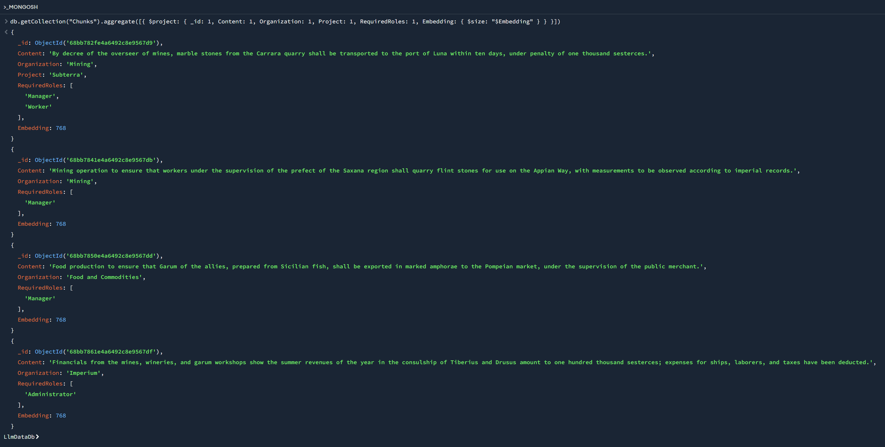

# Agent Delegation, RBAC and the RAG Pipeline

## Introduction
This repository implements a .NET Web API (Summarization API) that demonstrates fine-grained authorization (FGA) 
using RBAC and ABAC-style attributes. It evaluates delegated permissions for AI agents (On-Behalf-Of/token exchange) and 
shows a retrieval-augmented generation (RAG) pipeline with semantic search and LLM summarization.

Previously I shared how a .NET WebAPI might accomplish FGA 
using [RBAC/ABAC](https://github.com/SanketKaluskar/AccessPolicyAPI)-style attributes. 
I also shared how permissions might be [delegated to an AI agent](https://github.com/SanketKaluskar/Agent) 
via the On-Behalf-Of (OBO) flow (RFC 8693 OAuth 2.0 Token Exchange).

This document and code are the next part in that series and show the evaluation of such delegations. 
The intent is to describe the components involved, 
their interaction and help drive a fuller understanding of delegated permissions for AI agents. 

The following sections use a Roman Empire theme to illustrate roles. 
However, the concepts apply to any multi-tenant system with hierarchical access control. 

---
## A Roman World Created

Roman *Procuratores* were Administrators of the empire, especially in imperial provinces. 
They had oversight into multiple spheres in the imperium. 
Their mandate involved active, periodic collection of operational data across sectors. 

*Conductores* functioned like Managers with specific remit. 
Leasing mines from the state and managing logistics and finances. 
Or playing a managerial role in the Roman food supply system, working as contracted operators.

The *Operarii* were Workers, with task-specific roles. 
They worked on farms, roads, aqueducts, and mines. 
They executed assigned tasks without cross-project visibility in their organization.

---
## Problem Articulation

1. Procurator Ridiculus Aurelius wants categorized status of all the activity in the imperium. He wants to know about any roadblocks for the flint stone quarry operations in the Saxana region, whether the special project (code named Subterra) to supply marble to the port of Luna statim was underway. And he wants to know when Garum, yes that Garum of the Sicilian fish, will be in Pompei. 
- Administrators can access all relevant data (*across organizations*).

2. Conductor Verbose the Redundant is a former praeco (town crier). Now he is finding success as the Manager of a mining operation, where he also manages a special project (code named Subterra) to supply marble to the port of Luna. He uses the Summarization API to stay up to date with status of his mine, especially of the special project.  He also uses an Agent (agent92701) for helping compile data, but he understands Agents are denied access to special projects.
- Managers can access relevant data from *their organization*.
- OBO Agents can access relevant data from their organization (*excluding special projects*). 
- It is an invariant violation if subject organization != OBO actor organization.

3. Clueless Maximus is a Operarius/Worker on a special project (code named Subterra) in Verbose's mine. He keeps to his work and is not aware of any other tasks in the mine. He uses the Summarization API to learn about scheduling changes to his project. The API shows him data only from his project in the mine.
- Workers can access relevant data only for *their projects*.

There are no restrictions on the implementation of the Summarization API, other than wanting to minimize running/operational costs and to maximize summary relevance. 

---
## Solution Anatomy

### UML Class Diagram


### UML Sequence Diagram


### Chunks with Metadata as Claims
We create a *chunk* as an addressable unit of authZ. A chunk may be a portion of a larger document or corpus, but has associated attributes like 
- Content 
- Organization
- Project (optional)
- Required Roles and Embeddings (more on this later). 

AuthZ is evaluated on a per-chunk basis, using these attributes, applying biz rules (the ACL) from the following RBAC Matrix. 
A summarizer is given one or more chunks to arrive at a summary, therefore applying the ACL to withhold certain chunks prevents cross-organization leakage. 

RBAC is used for coarse-grained role assignments (e.g., Administrator, Manager) and ABAC for fine-grained filtering based on attributes like organization and project.
ABAC is not shown in the RBAC Matrix.

|  | Mining | Mining Project *SubTerra* | Food and Commodities | Imperium Financials |
| ----------- | ----------- | ----------- | ----------- | ----------- |
| Administrator | Y | Y | Y | Y |
| Manager (Mining) |  Y | Y | N | N |
| Agent OBO Manager (Mining) |  Y | N | N | N |
| Worker (SubTerra) |  N | Y | N | N |

RBAC Matrix. Column titles are Organizations/Projects. 
Rows are Roles/Attributes

### API Controller

We also create an API Controller (SummarizerController) to accept user requests and to orchestrate other components processing the requests. 
SummarizerController receives user queries, validates JWT claims, retrieves filtered chunks via IChunkRepository, invokes ISemanticSearchService 
for relevance scoring, and passes relevant chunks to ILLMService for summarization.

### Chunk Repository

We create interface IChunkRepository and its concrete implementation MongoChunkRepository. 
IChunkRepository/MongoChunkRepository provide durable access to chunks in MongoDB. 
The repository applies ACL checks per-chunk (RBAC + ABAC) so callers receive only authorized results.
We locate the ACL close to the resource (chunk) for locality of reference. 
This limits latency by avoiding round trips to policy engine(s) located elsewhere. 

### LLM Service

We create interface ILLMService and its concrete implementation OllamaLLMService, that uses Ollama as LLM. 

- The LLM service creates a summary when asked to do so via a prompt that contains the user query and context (chunks). 
- The LLM service also creates embeddings for the user query as well as for chunks (explained next). 

### Semantic Search Service

We also create interface ISemanticSearchService and a concrete SemanticSearchService to compute semantic similarity between a chunk and the user query. 
- This service accepts the user query, converts it to dense vector embeddings and computes a cosine similarity score between it and each of the chunks (that have passed the ACL). 
- Each chunk in the repository has its embeddings computed once at ingestion or update. Bulk updates occur via the `/summarize/migrate` endpoint.
- Chunks with a high semantic similarity score (configurable) are sent to the LLM (so SemanticSearchService is invoked before OllamaLLMService). 

The reason for this sequence is to prune chunks sent to the LLM and accomplish the following:
- Limits operating costs, as LLMs are metered by input/output tokens. Promotes grounded LLM output, as the input is relevant (semantically similar to the query). 
- Limits LLM latency, due to a smaller prompt size. 

In addition, semantic search is relatively inexpensive compared to LLM inference. 
Operating cost of query embedding is orders of magnitude less than prompt cost. 
Embedding for chunks is a onetime per-chunk cost. 
Costs for chunk retrieval (repository I/O) and computing chunk vs. query similarity are low.

#### Retrieval-Augmented Generation (RAG)

- The `/summarize/migrate` endpoint (used ad-hoc) generates embeddings for all chunks. This is a preprocessing step required for retrieval.
- At query time, preprocessed embeddings are used to find relevant chunks (via semantic search).
- Relevant chunks are part of the prompt to the LLM.

### VectorMath Service

Semantic similarity can be computed efficiently by a VectorDB, lacking which we store embeddings of type float[] and compute cosine similarity in code via IVectorMathService and VectorMathService. 

However, the abstractions in this high-level design allow plugging in a MongoDB/VectorDB later, i.e. have a MongoDB based implementation of ISemanticSearchService and deprecate SemanticSearchService.

### Chunks in MongoDB

Document Schema
```
{
  "_id": "chunk123",
  "content": "Text of the chunk",
  "organization": "Mining",
  "project": "Subterra",
  "roles": ["Worker", "Manager"],
  "embeddings": [0.1, 0.2, ..., 0.9]
}
```

 

### JWTs with Claims

The Summarization API accepts a JWT in the request's Authorization header. JWTs corresponding to roles from the RBAC Matrix are below.

```
POST http://localhost:5232/summarizer/query HTTP/1.1
Authorization: Bearer eyJhbGci...
Host: localhost:5232
Content-Type: application/json
Content-Length: 35

{ "query": "activity by category" }

```
JWT for Administrator

```
{
  "aud": "api://summarizer",
  "iss": "https://as.dev.example.com",
  "exp": 1756457796,
  "nbf": 1756454196,
  "iat": 1756454196,
  "sub": "ridiculus@imp.venividiinc.com",
  "name": "Ridiculus Aurelius",
  "organization": "Imperium",
  "roles": [
    "Administrator"
  ],
  "scope": "Files.Read",
  "azp": "441103f3-d65d-4857-9b15-a32260d33e3a",
  "app_name": "ExecutiveBriefings"
}
```

JWT for Manager

```
{
  "aud": "api://summarizer",
  "iss": "https://as.dev.example.com",
  "exp": 1756457796,
  "nbf": 1756454196,
  "iat": 1756454196,
  "sub": "verbose@mine.venividiinc.com",
  "name": "Verbose the Redundant",
  "organization": "Mining",
  "roles": [
    "Manager"
  ],
  "scope": "Files.Read",
  "azp": "d41ed10c-5ebd-4edc-902e-d7c38108206a",
  "app_name": "Scheduler"
}
```

JWT for Agent OBO Manager

```
{
  "aud": "api://summarizer",
  "iss": "https://as.dev.example.com",
  "exp": 1756457796,
  "nbf": 1756454196,
  "iat": 1756454196,
  "sub": "verbose@mine.venividiinc.com",
  "name": "Verbose the Redundant",
  "organization": "Mining",
  "roles": [
    "Manager"
  ],
  "scope": "Files.Read",
  "azp": "d41ed10c-5ebd-4edc-902e-d7c38108206a",
  "app_name": "Scheduler",
  "act": {
    "sub": "agent92701@mine.venividiinc.com",
    "azp": "816fdb84-e796-464a-a79a-f4511f4f49af",
    "app_name": "AgentService",
    "organization": "Mining",
    "identitytype": "agent"
  }
}
```

JWT for Worker

```
{
  "aud": "api://summarizer",
  "iss": "https://as.dev.example.com",
  "exp": 1756457796,
  "nbf": 1756454196,
  "iat": 1756454196,
  "sub": "clueless@mine.venividiinc.com",
  "name": "Clueless Maximus",
  "organization": "Mining",
  "project": "Subterra",
  "roles": [
    "Worker"
  ],
  "scope": "Files.Read",
  "azp": "d41ed10c-5ebd-4edc-902e-d7c38108206a",
  "app_name": "Scheduler"
}
```

### Request/Response Trace


